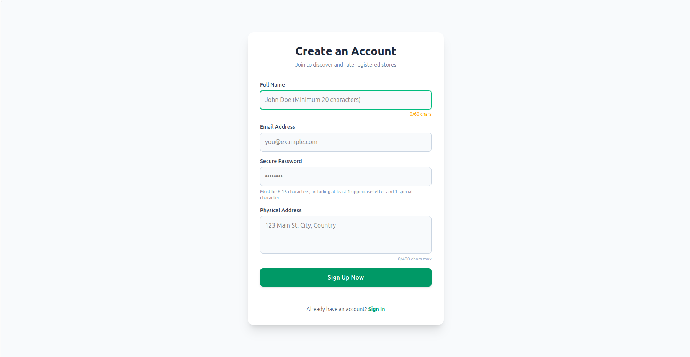
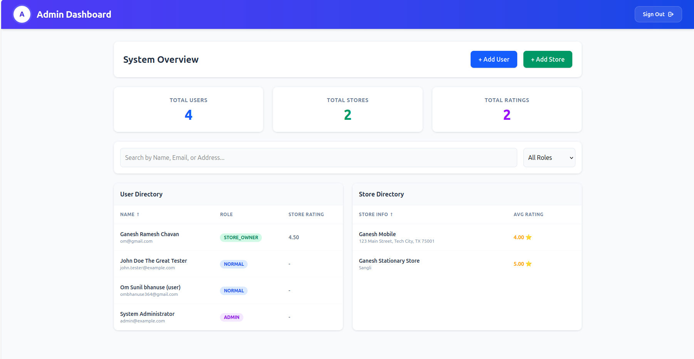
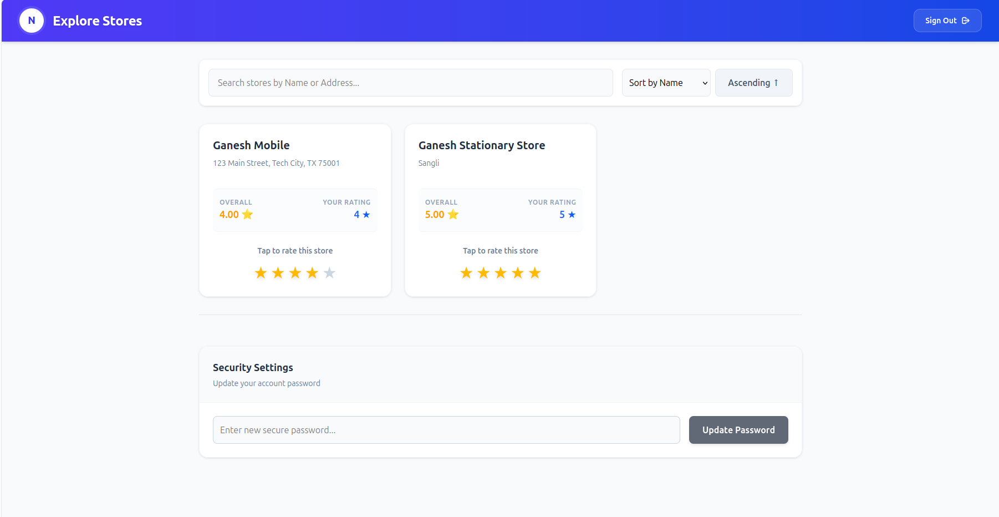
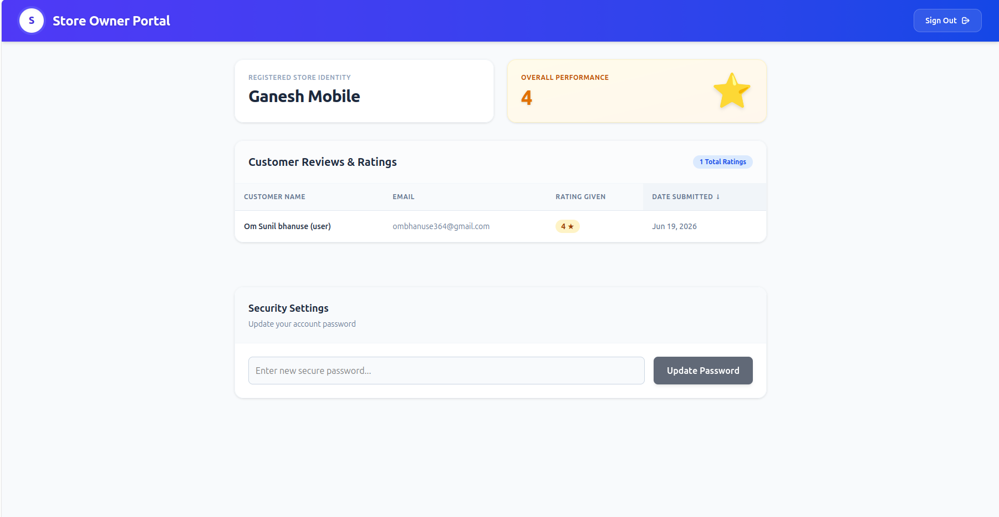

# 🌟 NexusRatings - Full-Stack Store Rating Platform

A full-stack web application that allows users to register, discover, and submit ratings for stores. Built with a focus on strict Role-Based Access Control (RBAC), secure authentication, and a interactive UI.

---

## 🚀 Tech Stack

**Frontend:**
* React.js (Vite)
* Tailwind CSS (Modern Glassmorphism UI)
* Axios (API Client with Automatic Token Interception)
* Context API (Global Auth State)

**Backend:**
* Node.js & Express.js (ES Modules)
* PostgreSQL (Hosted on NeonDB)
* JSON Web Tokens (JWT) for secure authentication
* bcrypt (Password hashing)

**Deployment:**
* Vercel (Frontend)
* Render (Backend API)

---

## ✨ Core Features & Functionality

### 🔐 Security & Architecture
* **Role-Based Access Control (RBAC):** Strictly enforced middleware protecting API routes for `ADMIN`, `NORMAL`, and `STORE_OWNER` roles.
* **Strict Validations:** Custom backend and frontend validations (e.g., Names strictly 20-60 characters, Passwords requiring mixed-case and special characters).
* **API Optimization:** Custom `useDebounce` hook implemented on the frontend to prevent API spamming during live searches.

### 🧑‍💼 User Roles

#### 1. System Administrator
* Complete oversight dashboard featuring real-time metrics.
* Ability to add new Admin, Normal, and Store Owner accounts.
* Register new stores and assign them to specific Store Owners.
* Users and stores with dynamic sorting (Ascending/Descending) and role-based filtering.

#### 2. Normal User
* Browse a searchable directory of all registered stores.
* Submit or modify a 1-5 star rating for any store.
* Change password management.

#### 3. Store Owner
* Dedicated analytics dashboard for their assigned store.
* View average overall rating and a detailed, sortable list of customers who have rated their business.
* Change password management.

---

## 📸 Application Screenshots

### Signup Page

*Strict form validations ensuring robust data entry.*

### System Administrator Dashboard

*Complete oversight dashboard featuring real-time metrics*

### User Dashboard

*star-rating system for stores listed with toast notifications.*

### Store Owner Dashboard

*Dedicated analytics dashboard for their assigned store.*


---

## 💻 Local Setup & Installation

### Prerequisites
* Node.js (v16+)
* A NeonDB / PostgreSQL instance

### Backend Setup
```bash
cd backend
npm install

# Create a .env file with your credentials
echo "PORT=5000" > .env
echo "NEON_DATABASE_URL=your_neon_db_url_here" >> .env
echo "JWT_SECRET=your_super_secret_key" >> .env

# Start the server
npm run dev